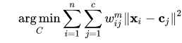
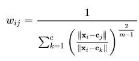
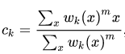
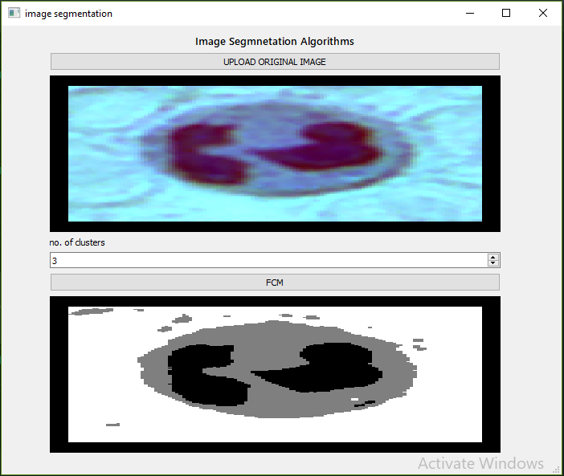

# Fuzzy C-mean Clustering Algorithm

## Midterm Project Description:
#### My role was to build a GUI and implement Fuzzy Cmean Clustering Algorithm for image segmentation 
## Algorithm Overview:
#### This algorithm works by assigning membership to each data point corresponding to the centre of each cluster (centroid). This is done by calculating the distance between the cluster center and the data point. The more the data is close to that centre the more it is related to that cluster
## Algorithm:
* Choose a number of clusters
* Assign coefficients randomly to each data point for being in the clusters.
* Repeat until convergance or reaching maximum number of iterations
  * Compute the centroid for each cluster 
  * Compute the distance between each data point and the centroid.
## Objective
##### minimizing the objective : 

##### where: 

##### the centroid:
 

## Results:
 

## Dataset:
[Data Set From](https://github.com/zxaoyou/segmentation_WBC)

[Understood the algorithm from](https://en.wikipedia.org/wiki/Fuzzy_clustering#General_description)
